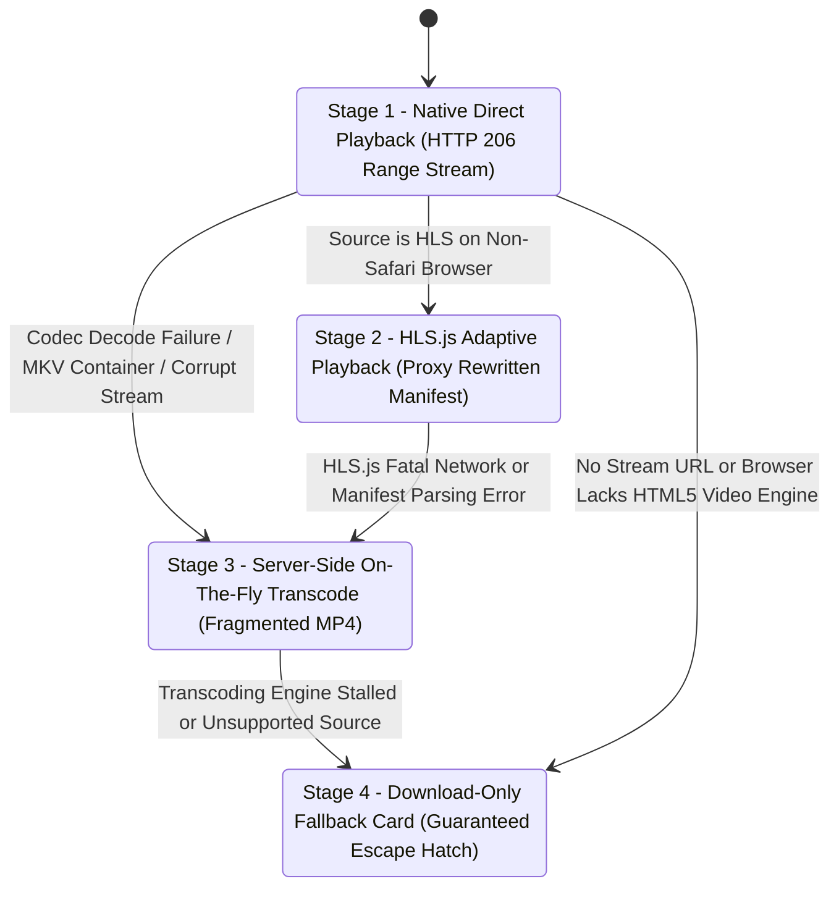

# MediaGrab AI — Video Playback Reliability & Proactive Hardening Architecture

> **Core Philosophy**: Video playback reliability is not a one-time fix; it is an ongoing engineering discipline. Platforms update their delivery mechanisms, browsers change autoplay policies, and CDNs adjust token lifetimes. MediaGrab AI's playback architecture guarantees that **failures are detected proactively, degraded gracefully through a deterministic fallback ladder, and never surface as a silent black screen.**

---

## 1. Pre-Flight Browser & Hardware Feature Detection

Rather than assuming browser capabilities and failing silently, the player interrogates the runtime environment **before** mounting or requesting media streams. Results are cached in `sessionStorage` and reused for the duration of the user session.

```mermaid
flowchart TD
    Mount[Player Mount / Open Request] --> CacheCheck{Capabilities Cached in Session?}
    CacheCheck -- Yes --> LoadCaps[Load Memoized Capabilities]
    CacheCheck -- No --> Detect[Execute Feature Probing]
    
    Detect --> HLSCheck[Probe Native HLS: video.canPlayType 'vnd.apple.mpegurl']
    Detect --> MSECheck[Probe MediaSource Extensions: 'MediaSource' in window]
    Detect --> CodecCheck[Probe Codecs: H.264, VP9, AV1, HEVC, MKV]
    Detect --> PlatformCheck[Detect Platform: iOS Safari, Android Chrome, Desktop]
    Detect --> NetworkCheck[Inspect Network Information API: effectiveType, RTT]
    
    HLSCheck & MSECheck & CodecCheck & PlatformCheck & NetworkCheck --> SaveCaps[Cache in sessionStorage]
    SaveCaps --> SelectStrategy[Select Initial Strategy on Fallback Ladder]
    LoadCaps --> SelectStrategy
```



### Probed Capabilities Matrix
- **Native HLS**: `video.canPlayType('application/vnd.apple.mpegurl')` (Truthful on Safari and iOS browsers).
- **MediaSource Extensions (MSE)**: `'MediaSource' in window && MediaSource.isTypeSupported('video/mp4; codecs="avc1.42E01E,mp4a.40.2"')` (Required for HLS.js).
- **Codecs**: H.264/AVC Baseline & High Profile, VP9 (`video/webm`), AV1 (`video/mp4`), HEVC (`video/mp4; codecs="hvc1"`), and MKV (`video/x-matroska`).
- **Platform & Form Factor**: Detects iOS, Android, and Desktop browsers to apply device-specific attributes and autoplay policies.
- **Connection Profile**: Bandwidth downlink and RTT to guide default resolution selection.

---

## 2. Progressive Playback Fallback Ladder

The player never relies on a single playback method. It attempts playback through a strict 4-stage ladder, automatically escalating upon failure with detailed diagnostic logging at each transition:



1. **Stage 1 — Native Browser Playback**:
   - Uses native `<video src="/api/stream/{token}/{key}">` with HTTP 206 partial content range requests.
   - Zero transcoding overhead, hardware-accelerated decode, lowest latency.
2. **Stage 2 — HLS.js-Mediated Playback**:
   - For adaptive HLS sources on browsers lacking native HLS support (Chrome, Firefox, Edge).
   - Upstream playlists are dynamically rewritten by the backend so all `.ts` and `.m4s` segments route through the CORS proxy.
3. **Stage 3 — Server-Side Transcoded Fallback**:
   - If the source container is MKV or uses an unsupported codec (AV1/VP9 without hardware decoder), the backend streams real-time fragmented MP4 (`-c:v libx264 -preset ultrafast -tune zerolatency -c:a aac -f mp4 -movflags frag_keyframe+empty_moov+default_base_moof`).
   - Output is cached to disk in `STORAGE_DIR/transcodes` to eliminate redundant re-encoding on seek or replay.
4. **Stage 4 — Download-Only Fallback**:
   - If all browser playback mechanisms fail, the player cleanly transitions into an informative fallback card: *"This video cannot be played directly inside your browser on this device, but you can still download the full file."*
   - Highlights the prominent **"Download instead"** button, preventing user frustration.

---

## 3. Buffering, Stalling & Error Recovery

Network fluctuations or high bitrates can cause playback to freeze. MediaGrab AI implements multi-tiered stall recovery:

- **Soft Recovery (3.5-second timeout)**:
  - If the player emits `waiting` or `stalled` events without resuming for $>3.5$ seconds, a micro-seek (`video.currentTime = video.currentTime + 0.01`) forces the browser media pipeline to refresh its buffer pipeline.
- **Auto-Quality Downshift (Stall Frequency Detector)**:
  - Tracks stall events in a rolling 20-second window.
  - If $\ge 3$ stalls occur within 20 seconds, the player automatically downshifts to the next lower available resolution tier (e.g. 1080p $\rightarrow$ 720p).
  - Displays a non-intrusive floating toast: *"Switched to 720p to keep playback smooth"*.
- **HLS.js Fatal Error Recovery**:
  - Traps `Hls.Events.ERROR` with `data.fatal === true`:
    - `NETWORK_ERROR`: Calls `hls.startLoad()` or triggers upstream token refresh on HTTP 403/410.
    - `MEDIA_ERROR`: Calls `hls.recoverMediaError()`.
    - If recovery fails: Escalates to Stage 3 (Server Transcode).

---

## 4. Mobile-Specific Hardening

Mobile browsers enforce strict operating system constraints that differ fundamentally from desktop environments:

- **Forced Fullscreen Prevention**:
  - Sets `playsInline` and `webkit-playsinline="true"` on the `<video>` element, ensuring iOS Safari does not hijack playback into native fullscreen mode and break custom player UI controls.
- **User Activation Autoplay Compliance**:
  - Mobile browsers strictly prohibit unmuted autoplay without prior touch activation.
  - On mobile devices, the player immediately displays a high-visibility **"Tap to Play"** center stage overlay, satisfying the browser user-gesture requirement before calling `.play()`.
- **Orientation Change Preservation**:
  - Listens to `window.orientationchange` and `resize` events during fullscreen playback.
  - Caches and restores `currentTime` across screen rotations, preventing mobile browsers from resetting the stream back to frame 0.

---

## 5. Memory & Resource Leak Prevention

To prevent browser memory bloat and background audio zombie processes during multi-video sessions:
- **Teardown Lifecycle**:
  - When the player modal closes or unmounts, all event listeners are stripped (`playing`, `waiting`, `stalled`, `error`, `orientationchange`, `keydown`).
  - Calls `hls.destroy()` and `plyr.destroy()` synchronously.
- **Request Invalidation**:
  - Employs an `AbortController` to cancel in-flight HTTP requests and stream probes if the user closes the modal or switches to another media item.
- **Blob URL Revocation**:
  - Automatically invokes `URL.revokeObjectURL()` for any local blob handles created during playback.

---

## 6. DRM Detection (Explicit Non-Goal)

Platforms serving Widevine, FairPlay, or PlayReady DRM-encrypted streams cannot legally or technically be decrypted or played outside approved proprietary players:

- **Detection**:
  - Checks for DRM flags during metadata extraction (`has_drm`, `is_drm`, `format_note` matching DRM markers).
  - Inspects HLS manifests for `#EXT-X-KEY:METHOD=SAMPLE-AES` or `#EXT-X-KEY:METHOD=cbcs`.
- **User-Facing Behavior**:
  - Immediately rejects the request with an explicit, honest classification:
    > *"This content is protected by Digital Rights Management (DRM / Widevine / FairPlay) and cannot legally or technically be extracted or played outside its official player."*
  - Skips all retry loops and never surfaces as a silent black screen.

---

## 7. Automated Cross-Browser & Device Test Suite

Cross-browser tests verify actual video playback progression (not merely HTTP 200 responses) across diverse engines:

```bash
$env:PYTHONPATH='backend'; python -m pytest backend/tests/test_cross_browser_playback.py
```

### Test Coverage Matrix
| Test Case | Target Environment | Verification Metric |
| :--- | :--- | :--- |
| **Progressive MP4 Playback** | Desktop Chromium (Chrome / Edge) | `loadedmetadata` + `currentTime > 0` progression |
| **Desktop WebKit / Firefox** | Firefox 1543 & WebKit 2359 | HTML5 video tag instantiation and codec compliance |
| **Mobile Safari Emulation** | iPhone 13 viewport & mobile user agent | `playsinline` + `webkit-playsinline` attribute verification |
| **RUM Telemetry Ingestion** | Async backend API | Aggregation, TTFF calculation, stall counting, spike detection |

---

## 8. Proactive Synthetic Monitoring

While RUM monitors real users, **Synthetic Monitoring** catches breakages before any user encounters them:
- **Execution**: Background runner executes every 30 minutes (`SyntheticPlaybackMonitor`).
- **Mechanism**: Launches headless Chromium via Playwright, loads a synthetic video playback harness, and verifies that `canPlayType` succeeds, `loadedmetadata` fires, and playback progresses.
- **Alerting**: If playback fails or stalls, immediately dispatches an alert through `AlertManager` (`SYNTHETIC_PLAYBACK_FAILURE`) to operator webhooks.
- **On-Demand**: Operators can trigger immediate verification via the Resilience Dashboard (`POST /api/system/resilience/run-synthetic-playback`).

---

## 9. Real User Monitoring (RUM) Telemetry

Every player session emits anonymized performance telemetry to `POST /api/system/rum/playback`:

| Metric | Measurement Unit | Purpose |
| :--- | :--- | :--- |
| **Time-to-First-Frame (TTFF)** | Milliseconds | Measures latency between player mount and first rendered video frame |
| **Buffering Count & Duration** | Stalls / Milliseconds | Measures network stability and identifies slow upstream CDNs |
| **Quality Switches** | Count | Measures adaptive rate-control and manual resolution shifts |
| **Strategy Ladder Step** | Enum (`native`, `hls.js`, `transcoded`) | Tracks fallback dependency frequency |
| **Browser & Platform** | String (`Chrome`, `Safari`, `iOS`, `Android`) | Enables browser-specific error spike detection |

### Anomaly Spiking Policy
If playback error rates on any specific browser/platform combination spike above **40%** (minimum 5 samples over 30 minutes), the system dispatches an alert:
`"High playback failure rate detected on Safari. Transcoded MP4 fallback may be required."`

---

## 10. Player Library Version Pinning

To guard against unexpected breaking changes introduced by third-party minor/patch releases:
- **Pinned Dependencies** (`frontend/package.json`):
  - `hls.js`: Strictly pinned to `1.7.3` (no caret `^` or tilde `~`).
  - `plyr`: Strictly pinned to `3.8.4` (no caret `^` or tilde `~`).
- **Upgrade Protocol**: Player library updates must pass the full Playwright cross-browser playback test matrix in a staging environment before being merged to production.

---

## 11. Explicit System Limitations (What Cannot Be Prevented)

Documenting boundaries honestly ensures correct architectural expectations:

1. **Zero-Day Browser Engine Updates**: A browser vendor (e.g. Google Chrome or Apple Safari) pushing an auto-update that alters media codec support in the hours before the synthetic monitoring interval triggers.
2. **DRM Protected Content**: Paid streaming services (Netflix, Disney+, Spotify) using hardware-attested Widevine L1 or FairPlay DRM.
3. **Hard Datacenter IP Blocks**: Source platforms that completely block the backend server's public IP range, preventing video byte streaming.
4. **Obscure / Outdated Hardware**: Legacy devices (e.g. Android 4.x, Internet Explorer 11) lacking MediaSource Extensions and H.264 hardware decoders.

---

## 12. Subtitle & Closed Captions (CC) Architecture

MediaGrab AI extracts both manual subtitles and high-accuracy automatic captions from supported platforms:
- **Extraction Pipeline**: yt-dlp queries `info['subtitles']` (priority) followed by `info['automatic_captions']`.
- **CORS-Safe Subtitle Proxy**: Remote `.vtt` and `.srt` tracks route through `/api/stream/subtitle?u={url}&lang={lang}`.
- **WebVTT Standard Compliance**: Upstream SRT subtitles are converted on-the-fly to standard WebVTT (`00:00:01,000` $\rightarrow$ `00:00:01.000` with `WEBVTT` header) to guarantee cross-browser `<track>` rendering.
- **1-Click Subtitle Download**: Users can download separate subtitle files directly via the UI with `Content-Disposition: attachment`.

---

## 13. Precision Video & Audio Clip Trimming

Users can download custom timestamp slices without having to download multi-gigabyte source files:
- **Range-Based Slicing**: Uses yt-dlp `--download-sections "*start-end"` and `--force-keyframes-at-cuts` to request only relevant HTTP ranges from remote CDNs.
- **Direct Stream Trimming**: Direct media links are trimmed via sandboxed FFmpeg (`-ss {start} -i {source} -to {end} -c copy`).
- **Input Sanitization**: Timestamp strings are validated against strict regex (`^[0-9]+(:[0-9]{2})?(:[0-9]{2})?(\.[0-9]+)?$`) to ensure total immunity against command-injection.

---

## 14. Anti-Hotlinking SSRF-Safe Thumbnail Proxy

Platforms like Instagram, TikTok, and YouTube CDNs block external referrers with HTTP 403 Forbidden:
- **Endpoint**: `/api/stream/thumbnail?u={url}&download={bool}`
- **Security**: Upstream URLs are validated against private IP ranges and cloud metadata endpoints prior to socket connection.
- **Header Normalization**: Strips hotlink-triggering `Referer` headers and caches image bytes (`Cache-Control: public, max-age=86400`).
- **HD Download**: Provides a 1-click "Download HD Thumbnail" button directly in the metadata card.

---

## 15. Keyboard Navigation & Player Accessibility

MediaGrab AI provides a full set of desktop hotkeys:

| Key | Scope | Action |
| :--- | :--- | :--- |
| **Ctrl + V** / **Cmd + V** | Global | Paste URL from clipboard anywhere on page & initiate analysis |
| **?** | Global | Open Keyboard Shortcuts cheatsheet modal |
| **Esc** | Global / Modals | Close open modal, video player, or audio drawer |
| **Space** | Player Active | Toggle Play / Pause |
| **←** / **→** | Player Active | Seek backward / forward 5 seconds |
| **J** / **L** | Player Active | Seek backward / forward 10 seconds |
| **M** | Player Active | Toggle audio Mute / Unmute |
| **F** | Player Active | Toggle Fullscreen mode |
| **P** | Player Active | Toggle floating Picture-in-Picture (PiP) window |
| **0 — 9** | Player Active | Seek to 0% — 90% of the media timeline |

