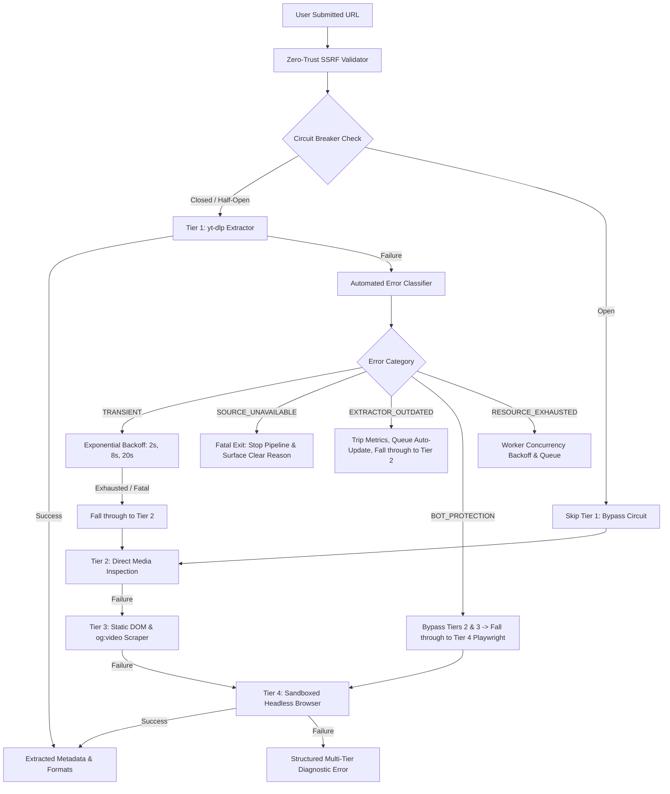
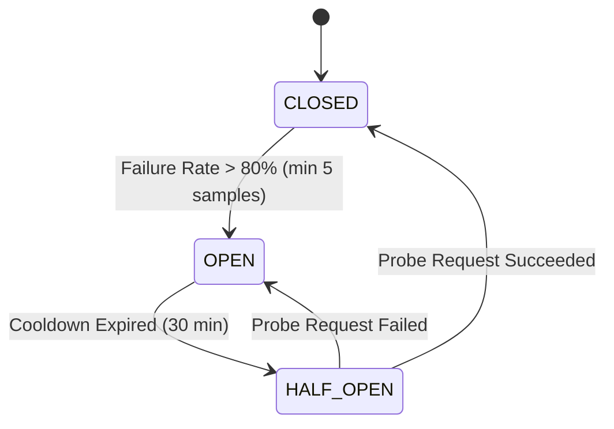

# MediaGrab AI: Automated Resilience & Self-Healing Architecture

## 1. System Overview

MediaGrab AI operates in an inherently volatile environment: downstream media platforms (YouTube, TikTok, Instagram, Twitter/X, Reddit, Vimeo, and thousands of independent video hosts) continuously alter DOM structures, anti-bot mechanisms, rate-limiting policies, and media delivery protocols.

To maintain maximum availability without requiring ongoing manual firefighting, MediaGrab AI implements an **autonomous self-healing and resilience framework** spanning the entire media ingestion and processing pipeline:



---

## 2. Automated Error Classification Taxonomy

Every error across all extraction tiers is captured, stripped of transient noise, and classified into one of five distinct recovery categories.

| Error Category | Diagnostic Criteria & Patterns | Automated Recovery Action | Fall-Through & Pipeline Behavior |
| :--- | :--- | :--- | :--- |
| **`TRANSIENT`** | `HTTP 429 Too Many Requests`, `HTTP 500/502/503/504`, socket timeout, connection reset, SSL handshake timeout, DNS temporary resolution failure | **Exponential backoff retry**: up to 3 attempts with staggered intervals (2s, 8s, 20s). Dynamic jitter prevents thundering herds. | If retries fail within the per-tier budget or hard 45s ceiling, advances to the next extraction tier. |
| **`SOURCE_UNAVAILABLE`** | Video deleted, user made video private, copyright takedown, geo-blocked / unavailable in country, requires account login / member-only access | **Immediate bail**: skips all retries and halts downstream tiers. | Immediately informs user with actionable explanation (e.g. "This video has been removed by the creator or requires an authenticated login"). |
| **`EXTRACTOR_OUTDATED`** | Regex parsing failure (`Unable to extract video ID`, `JS player signature error`, `extractor failed to parse`), schema mismatch on platform | **Self-healing dependency trigger**: flags extractor for automated PyPI update, records failure metrics. | Skips retrying Tier 1, immediately falls through to Tier 2 and Tier 3 scraping. |
| **`BOT_PROTECTION`** | Cloudflare Turnstile, Cloudflare 1020, PerimeterX, Datadome, Akamai Bot Manager, CAPTCHA challenge HTML | **Fast-track escalation**: skips pure HTTP tiers (Tier 2 direct inspection and Tier 3 static scrape). | Jumps directly to **Tier 4 Sandboxed Headless Browser** to execute dynamic JavaScript, render tokens, and inspect real-time network streams. |
| **`RESOURCE_EXHAUSTED`** | System memory >90%, CPU saturation, disk space critically low, worker pool saturated | **Adaptive backpressure**: queues incoming request, increases sleep intervals, temporarily scales worker concurrency down. | Pauses extraction worker until supervisor restores resource thresholds. |

---

## 3. Multi-Tier Circuit Breakers

To avoid wasting server resources and subjecting users to slow extraction timeouts on permanently broken or aggressively blocking domains, each extraction tier maintains independent per-domain circuit breakers.

### Circuit Breaker States & Transitions
- **`CLOSED` (Normal Operation)**: All requests are forwarded to the extraction tier. Metrics are recorded in a sliding window of the last **20 attempts**.
- **`OPEN` (Tripped)**: When a domain sustains a failure rate **> 80%** (with a minimum of **5 samples**), the circuit trips to `OPEN`. All subsequent extraction requests for that domain on this tier are **immediately bypassed** (0ms latency), falling through to the next tier without waiting.
- **`HALF_OPEN` (Trial Probe)**: After a **30-minute cooldown window**, the circuit enters `HALF_OPEN`. The next single request is allowed through as a probe:
  - If the probe succeeds: the circuit resets to `CLOSED` and the rolling window clears.
  - If the probe fails: the circuit resets back to `OPEN` for another 30-minute cooldown.



Operators can also manually reset individual domain circuits or reset all circuits via the **Resilience Dashboard** (`POST /api/system/resilience/circuits/reset`).

---

## 4. Self-Healing Dependency Management (`yt-dlp`)

Upstream platform extractors degrade quickly as platforms update their frontends. MediaGrab AI features an automated self-healing pipeline for `yt-dlp`:

### Automated Update Lifecycle
1. **Detection**:
   - Background scheduler checks PyPI API daily for newly published `yt-dlp` releases.
   - Alternatively, receiving $\ge 3$ `EXTRACTOR_OUTDATED` errors within 1 hour triggers an immediate on-demand version check.
2. **Upgrade Execution**:
   - Runs `pip install --upgrade yt-dlp` in a secure subprocess.
3. **Pre-Flight Smoke Test Suite**:
   Before the new version is committed to production traffic, it must pass 3 rigorous automated smoke tests:
   - **Test 1: CLI Version Check**: Verifies the binary runs and returns a valid semver string.
   - **Test 2: Direct Extraction**: Executes an end-to-end metadata extraction against a standardized sample URL (`https://www.youtube.com/watch?v=BaW_jenozKc`) in `--dump-json --skip-download` mode.
   - **Test 3: Python API Import & Instantiation**: Validates that `import yt_dlp` and `yt_dlp.YoutubeDL()` instantiate cleanly inside the running Python interpreter without C-extension or dependency conflicts.
4. **Automated Rollback**:
   - If *any* of the 3 smoke tests fail or timeout (>30s), the system initiates an immediate atomic rollback:
     ```bash
     pip install yt-dlp=={last_known_good_version}
     ```
   - Rollback events are logged, and an emergency alert is dispatched to operators.

---

## 5. Worker Health & Auto-Recovery Supervisor

Media downloads and transcodes can hang or stall due to half-closed sockets, deadlocks, or slow consumer pipelines. A dedicated background supervisor runs continuously:

- **Hung Subprocess Auto-Reaping**:
  - The supervisor scans the active job registry every 15 seconds.
  - If any download job exhibits no progress updates or heartbeat for **> 180 seconds (3 minutes)**, the underlying subprocess is terminated (`SIGTERM` followed by `SIGKILL` on POSIX, `taskkill /F /T` on Windows).
  - The job status transitions to `failed` with a clear explanation: `"Job terminated: worker stalled without progress for >180s."`
- **Dynamic Worker Concurrency Scaling**:
  - Concurrency dynamically adjusts between **1 and 4 concurrent workers** based on pending queue depth and CPU/memory pressure.
  - When the queue depth exceeds 3 jobs, concurrency is automatically expanded to relieve backlog.

---

## 6. Automated Monitoring, Alerting, & Webhooks

When anomalies exceed autonomous recovery capabilities, the alert subsystem notifies operators via configurable webhooks (compatible with Discord, Slack, and custom HTTPS endpoints):

### Alerting Conditions & Deduplication
- **Persistent Domain Failure**: A single domain sustains $\ge 5$ consecutive failures over a 10-minute window across multiple tiers.
- **Rollback Event**: A dependency update failed smoke testing and had to be rolled back.
- **Worker Starvation**: System memory or disk space critically low.
- **30-Minute Deduplication Window**: Prevents alert flooding; consecutive failures on the same domain are throttled so operators receive at most one webhook notification per 30-minute window per domain.

### Webhook JSON Payload Schema
```json
{
  "event": "PERSISTENT_EXTRACTION_FAILURE",
  "domain": "instagram.com",
  "failure_category": "BOT_PROTECTION",
  "failure_count": 6,
  "recent_error": "Cloudflare Turnstile token validation failed after 15s timeout",
  "timestamp": 1790493200,
  "recommended_action": "Inspect Instagram web session tokens or cookies",
  "metrics_summary": {
    "tier_success_rate": 0.12,
    "active_circuit": "OPEN"
  }
}
```

---

## 7. Fast-Fail Timing & Ceilings

To eliminate the frustrating "spinner runs forever then errors out" user experience:
- **Tier 1 (yt-dlp)**: 12-second hard socket/process timeout.
- **Tier 2 (Direct HTTP Check)**: 3-second `HEAD` / 5-second partial byte-range request timeout.
- **Tier 3 (Static DOM Scraper)**: 4-second HTTP request and parse timeout.
- **Tier 4 (Headless Browser)**: 15-second sandboxed browser session timeout with 10-second network idle cap.
- **Pipeline Overall Ceiling**: A strict **45-second hard ceiling** across all tiers, retries, and backoffs combined. If the 45-second threshold is reached, execution terminates gracefully with a comprehensive diagnostic error report detailing what was attempted.

---

## 8. Explicit System Limitations (What Cannot Be Self-Healed)

While MediaGrab AI automates recovery for transient network issues, extractor code drift, hung jobs, and basic bot walls, **certain failure modes fundamentally cannot be resolved through automated heuristics** and require human intervention or source-level access:

### 1. Permanent CDN / Cloudflare IP Blacklisting
- **Why it happens**: Massive media hosting CDNs (e.g. YouTube SABR, Cloudflare Bot Management) may flag and permanently block the hosting server's public IP range or datacenter ASN.
- **Self-Healing Limit**: Exponential backoffs and browser emulation will continue to receive HTTP 403 Forbidden.
- **Resolution**: Operators must configure residential or rotating outbound proxy pools via `PROXIES` in `config.py`.

### 2. Legal Takedowns & Geoblocked Content
- **Why it happens**: DMCA notices, copyright strikes, court-ordered injunctions, or licensing restrictions limit content to specific sovereign territories.
- **Self-Healing Limit**: The content does not exist on the target server or is actively filtered at the CDN origin. Retrying is futile and wasteful.
- **Resolution**: System classifies this as `SOURCE_UNAVAILABLE` and terminates immediately without wasting retries.

### 3. Hard Paywalls & Strict Multi-Factor User Authentication
- **Why it happens**: Platforms such as OnlyFans, Patreon member tiers, private Facebook groups, or Netflix require active authenticated session state and DRM decryption keys.
- **Self-Healing Limit**: Headless browsers cannot fabricate credentials or solve hardware-attested DRM (Widevine Level 1).
- **Resolution**: MediaGrab AI respects private authenticated boundaries and will not attempt unauthorized credential stuffing.

### 4. Zero-Day Dynamic Signature / Algorithm Obfuscation
- **Why it happens**: Platforms (e.g. YouTube `n-sig` or `sig` changes) periodically introduce obfuscated JavaScript mathematical transformation functions to scramble media stream URLs.
- **Self-Healing Limit**: Until the open-source community or `yt-dlp` maintainers deobfuscate the algorithm and release a new version to PyPI, local extractors cannot decrypt the media URL.
- **Resolution**: The system logs this as `EXTRACTOR_OUTDATED`, trips the circuit breaker to avoid wasting CPU, dispatches an operator alert, and automatically fetches the update as soon as PyPI publishes a fix.
